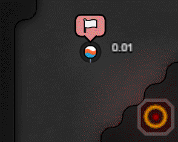

# Klean bot manifesto

### What is Klean bot?
---

Klean bot is a fork of [KasamiBot](https://github.com/kasami/kasamibot).

Klean bot is meant to be an NPC of Shard 1.

The Kleaners are a people that want to save the Shard and help restore it to its natural beauty. They roam the edge of the Shard improving the creeps and the land they pass. They provide aid to needy creeps and perform restoration projects on nearby rooms. They want to spread their aid and prevent overuse of the land. Because of this, they are nomadic and constantly on the move. Unlike most inhabitance of the Shard they don't want to stake out a claim and hunker down, they want to get out and see the Shard.

They have adopted many standards to live by which they believe will bring peace and vitality to the Shard.

* 100% Wall free, walls are forever and litter our shard
* Free and open borders, don't block travel of creeps and leave ramparts public
* Conflict Free, there is enough energy & minerals for all of us
* Preservation, unclaimed rooms will be restored to their natural beauty
* Process power to offset energy footprint and invest in the future
* All minerals are mined in a sustainable fashion
* Creepitarian shipments of energy will be sent to nearby rooms in crisis
* Use links and terminals whenever possible to reduce transport intent pollution
* All natural, organic, gluten-free boosts
* Give back, subscription tokens will be given to people who #help the most 🧡
* Room controllers will be praised to the highest level ensuring as much energy as possible is returned to the shard.
* Nuclear disarmament, nukes aren't good for anyone!
* Population control, fewer creeps will produce more ticks, for the whole shard.
* Reduce room usage, stay 10% bellow GCL with a cap of 30* rooms. Reducing a little can save a lot.
* Work to reduce the effects of Shard holing
* Wealth redistribution, will work to depress market prices

---

## Spec Sheet
* Klean bot will only occupy the edge sector
* Klean bot will only expand in a clockwise direction
* Once 30* rooms are established the farthest back room will be abandoned and the expansion clockwise will continue.
* Main goal of making a trip around the edge of the shard
* Will not avoid [LOAN clone detection](https://www.leagueofautomatednations.com/map/shard1/bots)
* Base will be inverted for easy identification

---

### Protesters

We believe that portals are caused by creeps and we need to act now to stop Shard holing. We will seek out these phenomena and rally at them to bring attention to them now while there is still hope that we can change our ways.

---

### Highway Resources

We go off the most ancient of rules. Finders Keepers. If another player can reach the bank or deposit before the Kleaners can, they will forfeit the resource to them. If they can get to the bank first and claim it they will fight off others that try and interfere. Claimers will be spawned with a delay of ~100 ticks after discovery.

---

### Restoration

The kleaners perform restoration on the unoccupied rooms it finds in range. These restoration projects will remove all structures from the room, restoring them to their natural beauty. The removal of these structures will also provide the following benefits:

* No exits are blocked for easy pathfinding
* No blocked controllers for easier expansion.
* Fewer game objects help all of us

---

### Kleansers
> Prospects of a new economy have cooled tensions and only the most radical are looking to the other shards. There are some that still venture through the portals scouting for a new home when the unrest returns.

When population control measures take place at 30 rooms there will be a radical group that splits off the Kleaners.

The Kleansers will be exiled to the other shards. They will follow the same rules but will be aggressive to other players in their sector.

* They will be exiled to shard 0 and 2.
* They will be aggressive to all neighbors, as the only way to save the shard is to rid it of those that pollute it.
* They will have a 1/5 chance of requesting minerals from Kleaner base.
* There is a 1/2 chance that it will be the mineral they requested.
* The number of minerals will be random.
* They will sell unwanted minerals on the market for a discount.
* Credits gained will be used to buy needed minerals from the market.
* Kleansers will fly a black flag and build upright
* Kleansers stand with their comrades in shard 3 and operate on 20 CPU

---

### Why?

Screeps has been a great learning tool for me. I purchased this gaming having never written any javascript (PowerShell is my day job). I was able to jump through the tutorials read the API docs and I was off to the races. Already being familiar with reading API docs and basic programming knowledge I am sure my learning curve was not as sharp as some. As my bot and my knowledge grew I hobbled together code. I was constantly racing to code all the new items my growing RCL gave me.

One tool that helped me and that I still love is the private server. I would load my bot in there and respawn over and over. Running super fast ticks and game mods I was able to get months worth of game time in days. This continuous build system helps me work out issues and advance faster then I would have otherwise. After a while, I had quite a few rooms and most economic items coded 'good enough'. By this time my javascript or rather typescript, skills had grown but my code was having some growing, pains. I knew the best thing to do was a total rewrite, but I was not sure my motivation could take that kind of a blow. So, I stalled with military code, but I have always had reservations about being aggressive towards other players.

So, defense code. But I needed some attackers...

I started loading my private server up with public bots as opponents. But none of them were too aggressive so they were no help to my defense code. KasamiBot, however, did have some attack code and was in typescript so I thought I would just mess around with that to make it more aggressive. As I was poking around in kbot the fact that I needed to redo my code was more and more apparent. I saw things like classes that I knew nothing about and spurred another sense of learning for better uses of the language. I started spending more time modding KasamiBot then my own bot.

By this time my old bot has sat idle now on the public server for 6 months. I reached GCL 26 and felt as though I had done a good, 'once through' of the game. During this time I thought about the public bot on public server issue and the scourge that is NCPs. I chose to embrace the idea of a bot acting as an NPC. I feel most negative feelings about people using public bots is that they are not playing the game and essentially using 'cheat codes'. They are then using this advantage to run amuck in their sector. I have been actively coding on this base for quite some time and will continue to do so. This bot will be a friendly NPC and will give no unsolicited aggression to other players. It will, in fact, provide help to the players around it and offer them something to interact with. I was also inspired by [Church of the END](https://docs.google.com/document/d/1pgktG9UyGEVYhsrhVqZwJVwVWnjwVuyghx86gpaCz3Q/edit#) and making some kind of [Langoliers](https://en.wikipedia.org/wiki/Four_past_Midnight#The_Langoliers) garbage collector. I loved the path that [TooAngel was going in with quests](https://github.com/TooAngel/screeps/blob/master/doc/Quests.md) and I am excited for [strongholds](https://screeps.com/forum/topic/2362/draft-npc-strongholds). I hope to try and add to this PvE type of play.

And because who doesn't love script kitties!

###### *lvl 8 rooms
